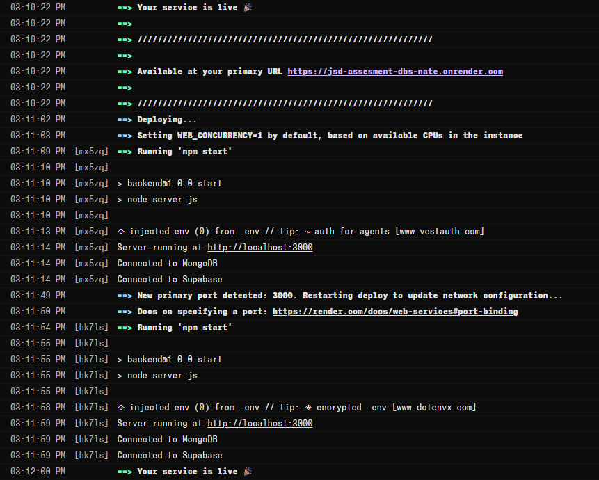
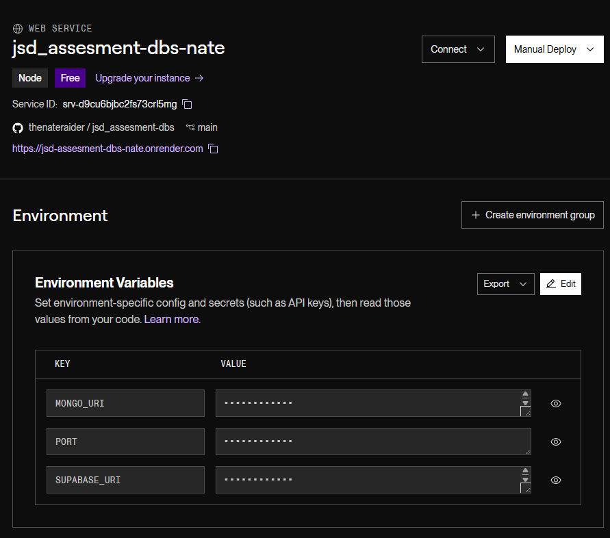
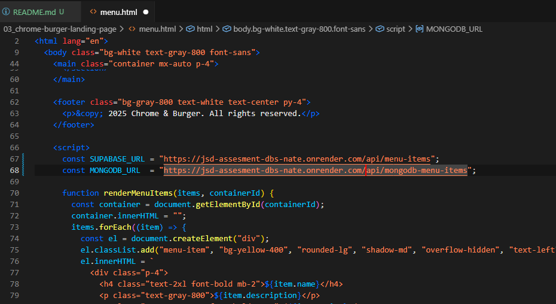
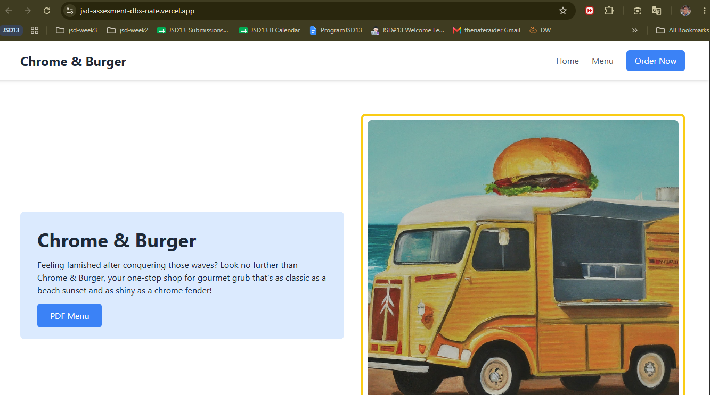

# JSD-ASSESSMENT-DBS

## Backend Deployed
 ทดลอง Deploy Backend ใส่ใน Render เรียบร้อยแล้ว

ลิงค์ API >> https://jsd-assesment-dbs-nate.onrender.com/ 

ทำการตั้ง Environment Variable บน Render

## Frontend Deployed

นำลิงค์ API ที่ได้ไปใส่ใน script call ในส่วนของ menu.html เพื่อดึงค่าเมนูจริง จากนั้นก็ให้ git commit และ push ไป และไป build หน้าเว็บ Frontend ผ่าน Vercel 

ลิงค์หน้าเว็บ Frontend ที่ทำการเชื่อมต่อกับ db แล้ว >> https://jsd-assesment-dbs-nate.vercel.app/

